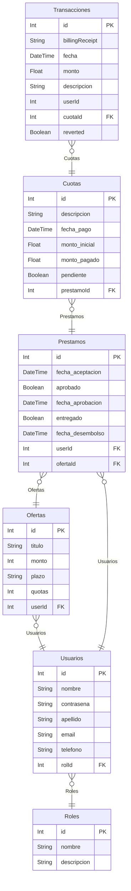

# ERD DB Amiloz

> A continuación el detalle de las entidades y relaciones de la base de datos de Amiloz.

## Entidades

### `Usuarios`

**Properties**

- `id`: id único usuarios
- `nombre`: nombre de usuario
- `contrasena`: contraseña de usuario
- `apellido`: apellido de usuario
- `email`: correo de usuario
- `telefono`: teléfono de usuario
- `rolId`: id de rol (FK)

### `Roles`

**Properties**

- `id`: id único de rol
- `nombre`: nombre de rol
- `descripcion`: descripción de rol

### `Ofertas`

**Properties**

- `id`: id único de oferta
- `titulo`: titulo de oferta
- `monto`: monto total de la oferta
- `plazo`: frecuencia de pago de las cuotas
- `quotas`: número de cuotas
- `userId`: usuario a quien pertenece la oferta (FK)

### `Prestamos`

**Properties**

- `id`: id único de préstamo
- `fecha_aceptacion`: fecha de aceptación del préstamo por parte del usuario
- `aprobado`: boolean de aprobación del préstamo
- `fecha_aprobacion`: fecha de aprobación del préstamo por parte de la empresa
- `entregado`: boolean de entrega del préstamo
- `fecha_desembolso`: fecha de desembolso del préstamo por parte de la empresa
- `userId`: usuario a quien pertenece el préstamo (FK)
- `ofertaId`: oferta a la que corresponde el préstamo (FK)

### `Cuotas`

**Properties**

- `id`: id único de cuota
- `descripcion`: descripción de la cuota
- `fecha_pago`: fecha de pago de la cuota
- `monto_inicial`: monto inicial de la cuota
- `monto_pagado`: monto pagado de la cuota al momento
- `pendiente`: boolean de pendiente de pago de la cuota (si es true aún no se ha pagado por completo)
- `prestamoId`: id de préstamo (FK)

### `Transacciones`

**Properties**

- `id`: id único de transacción
- `billingReceipt`: recibo de pago del proveedor de pagos
- `fecha`: fecha de recibo de pago
- `monto`: monto de pago a cuota
- `descripcion`: descripción de la transacción
- `userId`: usuario que realizó la transacción (FK)
- `cuotaId`: cuota a la cual corresponde la transacción (FK)
- `reverted`: boolean de reversión de transacción (si es true la transacción fue revertida)
